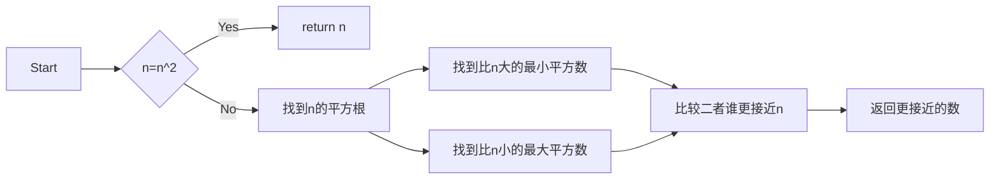

# 实验二 Python变量、简单数据类型

班级： 21计科02班

学号： B20230302210

姓名： 陶鑫

Github地址：<https://github.com/Muyu-ikun>

CodeWars地址：<https://www.codewars.com/users/Muyu-ikun>

---

## 实验目的

1. 使用VSCode编写和运行Python程序
2. 学习Python变量和简单数据类型

## 实验环境

1. Git
2. Python 3.10
3. VSCode
4. VSCode插件

## 实验内容和步骤

### 第一部分

实验环境的安装

1. 安装Python，从Python官网下载Python 3.10安装包，下载后直接点击可以安装：[Python官网地址](https://www.python.org/downloads/)
2. 为了在VSCode集成环境下编写和运行Python程序，安装下列VScode插件
   - Python
   - Python Environment Manager
   - Python Indent
   - Python Extended
   - Python Docstring Generator
   - Jupyter
   - indent-rainbow
   - Jinja

---

### 第二部分

Python变量、简单数据类型和列表简介

完成教材《Python编程从入门到实践》下列章节的练习：

- 第2章 变量和简单数据类型

---

### 第三部分

在[Codewars网站](https://www.codewars.com)注册账号，完成下列Kata挑战：

---

#### 第1题：求离整数n最近的平方数（Find Nearest square number）

难度：8kyu

你的任务是找到一个正整数n的最近的平方数
例如，如果n=111，那么nearest_sq(n)（nearestSq(n)）等于121，因为111比100（10的平方）更接近121（11的平方）。
如果n已经是完全平方（例如n=144，n=81，等等），你需要直接返回n。
代码提交地址
<https://www.codewars.com/kata/5a805d8cafa10f8b930005ba>

程序源代码如下：

```python
import math

def nearest_sq(n):
    # 如果n是完全平方数，则直接返回n
    if int(math.sqrt(n))**2 == n:
        return n
    # 否则，找到n的平方根
    root = int(math.sqrt(n))
    # 找到比n大的最小平方数
    next_sq = (root+1)**2
    # 找到比n小的最大平方数
    prev_sq = (root)**2
    # 判断哪个更接近n
    if n - prev_sq < next_sq - n:
        return prev_sq
    else:
        return next_sq
```

---

#### 第2题：弹跳的球（Bouncing Balls）

难度：6kyu

一个孩子在一栋高楼的第N层玩球。这层楼离地面的高度h是已知的。他把球从窗口扔出去。球弹了起来,  例如:弹到其高度的三分之二（弹力为0.66）。他的母亲从离地面w米的窗户向外看,母亲会看到球在她的窗前经过多少次（包括球下落和反弹的时候）？

一个有效的实验必须满足三个条件：

- 参数 "h"（米）必须大于0
- 参数 "bounce "必须大于0且小于1
- 参数 “window "必须小于h。

如果以上三个条件都满足，返回一个正整数，否则返回-1。
**注意:只有当反弹球的高度严格大于窗口参数时，才能看到球。**
代码提交地址
<https://www.codewars.com/kata/5544c7a5cb454edb3c000047/train/python>

程序源代码如下：

```python
def ball_bounce(h, bounce, window):
    # 检查条件是否满足
    if h <= 0 or bounce <= 0 or bounce >= 1 or window >= h:
        return -1
    
    # 初始下落次数为1
    count = 1
    # 计算球的下一次弹起高度
    h = h * bounce
    
    # 当球的高度大于窗户高度时，继续计算下一次弹起高度并增加次数
    while h > window:
        count += 2  # 每次下落和弹起都算一次
        h = h * bounce
    
    return count
```

---

#### 第3题： 元音统计(Vowel Count)

难度： 7kyu

返回给定字符串中元音的数量（计数）。对于这个Kata，我们将考虑a、e、i、o、u作为元音（但不包括y）。输入的字符串将只由小写字母和/或空格组成。

代码提交地址：
<https://www.codewars.com/kata/54ff3102c1bad923760001f3>

程序源代码如下：

```python
def get_count(s):
    vowels = ['a', 'e', 'i', 'o', 'u']
    count = 0
    for char in s:
        if char.lower() in vowels:
            count += 1
    return count
```

---

#### 第4题：偶数或者奇数（Even or Odd）

难度：8kyu

创建一个函数接收一个整数作为参数，当整数为偶数时返回”Even”当整数位奇数时返回”Odd”。
代码提交地址：
<https://www.codewars.com/kata/53da3dbb4a5168369a0000fe>

程序源代码如下：

```python
def even_or_odd(n):
    if n % 2 == 0:
        return "Even"
    else:
        return "Odd"
```

### 第四部分

使用Mermaid绘制程序流程图

安装Mermaid的VSCode插件：

- Markdown Preview Mermaid Support
- Mermaid Markdown Syntax Highlighting

使用Markdown语法绘制你的程序绘制程序流程图（至少一个），Markdown代码如下：




查看Mermaid流程图语法-->[点击这里](https://mermaid.js.org/syntax/flowchart.html)

使用Markdown编辑器（例如VScode）编写本次实验的实验报告，包括[实验过程与结果](#实验过程与结果)、[实验考查](#实验考查)和[实验总结](#实验总结)，并将其导出为 **PDF格式** 来提交。

## 实验过程与结果

请将实验过程与结果放在这里，包括：

- [第二部分 Python变量、简单数据类型和列表简介](#第二部分)
- [第三部分 Codewars Kata挑战](#第三部分)
- [第四部分 使用Mermaid绘制程序流程图](#第四部分)

代码运行结果的文本可以直接粘贴在这里。

**注意：不要使用截图，Markdown文档转换为Pdf格式后，截图可能会无法显示。**

## 实验考查

请使用自己的语言并使用尽量简短代码示例回答下面的问题，这些问题将在实验检查时用于提问和答辩以及实际的操作。

### 1. Python中的简单数据类型有那些？我们可以对这些数据类型做哪些操作？

#### 在Python中，常见的简单数据类型有：

- 整数（int）：表示整数值，可以进行基本的数学运算（如加减乘除、取余等）和比较操作（如等于、大于、小于等）。
- 浮点数（float）：表示带有小数点的数值，可以进行与整数相同的数学运算和比较操作。
- 布尔值（bool）：表示真（True）或假（False），可以进行逻辑运算（如与、或、非等）和比较操作。
- 字符串（str）：表示文本，可以进行字符串连接、切片、长度计算等操作。
- None：表示空值或缺失值，用于表示一个变量没有值。
  
对于这些简单数据类型，我们可以进行各种操作，包括但不限于：

- 数学运算：加法、减法、乘法、除法、取余等。
- 比较操作：等于、不等于、大于、小于、大于等于、小于等于等。
- 逻辑运算：与、或、非等。
- 字符串操作：字符串连接、切片、查找、替换、大小写转换等。
- 类型转换：将一个数据类型转换为另一个数据类型，如整数转为字符串、字符串转为整数等。
  
#### 2.为什么说Python中的变量都是标签？

在Python中，变量被称为标签（label），是因为变量实际上是对内存中某个对象的引用。当我们创建一个变量并将其赋值给一个对象时，实际上是将变量标签贴在了该对象上。

Python中的变量没有固定的数据类型，可以随时引用不同类型的对象。这意味着变量可以在运行时引用不同的对象，而不需要提前声明或指定数据类型。这种灵活性使得Python成为一种动态类型语言。

当我们对变量进行操作时，实际上是对被标签引用的对象进行操作。例如，当我们对一个整数变量进行加法运算时，实际上是对该整数对象进行加法运算。当我们将一个变量赋值给另一个变量时，实际上是将两个变量标签贴在同一个对象上。

由于变量只是对对象的引用，所以可以多个变量引用同一个对象。当一个变量的值发生改变时，其他引用同一对象的变量也会受到影响。这种特性在Python中被称为"引用传递"。

因此，我们可以说Python中的变量都是标签，因为它们只是对对象的引用，而不是存储实际数据的容器。这种设计使得Python具有灵活性和简洁性，并且可以更方便地操作和管理对象。

#### 3.有哪些方法可以提高Python代码的可读性？

使用有意义的变量名：给变量、函数和类取名时使用具有描述性的名称，能够清楚地表达其用途和含义。

添加注释：在代码中添加注释，解释代码的功能、实现思路、输入输出等信息。注释应该简洁明了，不过度冗长。

使用空白行和缩进：合理地使用空白行和缩进，使代码结构清晰，易于阅读。适当的缩进可以突出代码的逻辑层次。

模块化和函数化：将代码分解为多个模块和函数，每个模块和函数负责一个具体的功能。这样可以提高代码的可维护性和可重用性。

减少代码行长度：尽量避免一行代码过长，一般推荐每行代码不超过80个字符。可以使用换行符、括号和续行符来分割长行代码。

使用空格和括号：在适当的地方使用空格和括号，使代码更加清晰。例如，在运算符周围加上空格，使用括号明确优先级等。

使用合适的命名约定：遵循命名约定，如使用小写字母和下划线命名变量和函数，使用驼峰命名法命名类等。这样可以使代码更易读和一致。

使用合适的数据结构和算法：选择合适的数据结构和算法，能够使代码更加高效和易读。例如，使用列表推导式代替循环，使用字典代替多个变量等。

## 实验总结

编程工具的使用：我使用了Python作为编程语言，并使用了Python的集成开发环境（IDE）来编写和运行代码。

数据结构：我学习了Python中的常用数据结构，如列表、元组、字典和集合。我了解了它们的特点、用法和操作。

程序语言的语法：我学习了Python的语法规则和基本语句，如变量、条件语句、循环语句、函数和类的定义等。
