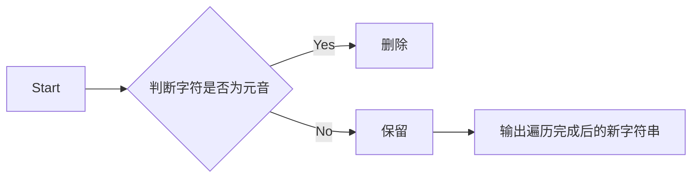

# 实验三 Python列表

班级： 21计科02班

学号： B20230302210

姓名： 陶鑫

Github地址：<https://github.com/Muyu-ikun>

CodeWars地址：<https://www.codewars.com/users/Muyu-ikun>

---

## 实验目的

1. 学习Python的简单使用和列表操作
2. 学习Python中的if语句

## 实验环境

1. Git
2. Python 3.10
3. VSCode
4. VSCode插件

## 实验内容和步骤

### 第一部分

Python列表操作

完成教材《Python编程从入门到实践》下列章节的练习：

- 第3章 列表简介
- 第4章 操作列表
- 第5章 if语句

---

### 第二部分

在[Codewars网站](https://www.codewars.com)注册账号，完成下列Kata挑战：

---

#### 第一题：3和5的倍数（Multiples of 3 or 5）

难度： 6kyu

如果我们列出所有低于 10 的 3 或 5 倍数的自然数，我们得到 3、5、6 和 9。这些数的总和为 23. 完成一个函数，使其返回小于某个整数的所有是3 或 5 的倍数的数的总和。此外，如果数字为负数，则返回 0。

注意：如果一个数同时是3和5的倍数，应该只被算一次。

**提示：首先使用列表解析得到一个列表，元素全部是3或者5的倍数。
使用sum函数可以获取这个列表所有元素的和.**

python源代码如下：

```python
def solution(number):
    if number < 0:
        return 0
    else:
        multiples = [i for i in range(number) if i % 3 == 0 or i % 5 == 0]
        return sum(multiples)
```

代码提交地址：
<https://www.codewars.com/kata/514b92a657cdc65150000006>

---

#### 第二题： 重复字符的编码器（Duplicate Encoder）

难度： 6kyu

本练习的目的是将一个字符串转换为一个新的字符串，如果新字符串中的每个字符在原字符串中只出现一次，则为"("，如果该字符在原字符串中出现多次，则为")"。在判断一个字符是否是重复的时候，请忽略大写字母。

例如:

```python
"din"      =>  "((("
"recede"   =>  "()()()"
"Success"  =>  ")())())"
"(( @"     =>  "))(("
```

python源代码如下：

```python
def duplicate_encode(word):
    #your code here
    word = word.lower()
    new_word = ""
    for char in word:
        if word.count(char) > 1:
            new_word += ")"
        else:
            new_word += "("
    return new_word
```

代码提交地址:
<https://www.codewars.com/kata/54b42f9314d9229fd6000d9c>

---

#### 第三题：括号匹配（Valid Braces）

难度：6kyu

写一个函数，接收一串括号，并确定括号的顺序是否有效。如果字符串是有效的，它应该返回True，如果是无效的，它应该返回False。
例如：

```python
"(){}[]" => True 
"([{}])" => True
 "(}" => False
 "[(])" => False 
"[({})](]" => False
```

**提示：
python中没有内置堆栈数据结构，可以直接使用`list`来作为堆栈，其中`append`方法用于入栈，`pop`方法可以出栈。**

代码提交地址
<https://www.codewars.com/kata/5277c8a221e209d3f6000b56>

python源代码如下：

```python
def valid_braces(s):
    stack = []
    for char in s:
        if char == '(' or char == '[' or char == '{':
            stack.append(char)
        else:
            if not stack:
                return False
            if char == ')' and stack[-1] != '(':
                return False
            if char == ']' and stack[-1] != '[':
                return False
            if char == '}' and stack[-1] != '{':
                return False
            stack.pop()
    return not stack
```

---

#### 第四题： 从随机三元组中恢复秘密字符串(Recover a secret string from random triplets)

难度： 4kyu

有一个不为你所知的秘密字符串。给出一个随机三个字母的组合的集合，恢复原来的字符串。

这里的三个字母的组合被定义为三个字母的序列，每个字母在给定的字符串中出现在下一个字母之前。"whi "是字符串 "whatisup "的一个三个字母的组合。

作为一种简化，你可以假设没有一个字母在秘密字符串中出现超过一次。

对于给你的三个字母的组合，除了它们是有效的三个字母的组合以及它们包含足够的信息来推导出原始字符串之外，你可以不做任何假设。特别是，这意味着秘密字符串永远不会包含不出现在给你的三个字母的组合中的字母。

测试用例：

```python
secret = "whatisup"
triplets = [
  ['t','u','p'],
  ['w','h','i'],
  ['t','s','u'],
  ['a','t','s'],
  ['h','a','p'],
  ['t','i','s'],
  ['w','h','s']
]
test.assert_equals(recoverSecret(triplets), secret)
```

```python
def recoverSecret(triplets):
    # 构建字母之间的关系图
    graph = {}
    for triplet in triplets:
        for letter in triplet:
            if letter not in graph:
                graph[letter] = set()
    
    for triplet in triplets:
        graph[triplet[0]].add(triplet[1])
        graph[triplet[1]].add(triplet[2])
    
    # 使用深度优先搜索拓扑排序找出字母的正确顺序
    visited = set()
    result = []
    
    def visit(node):
        if node not in visited:
            visited.add(node)
            for neighbor in graph[node]:
                visit(neighbor)
            result.insert(0, node)
    
    for letter in graph:
        visit(letter)
    
    return ''.join(result)
```

代码提交地址：
<https://www.codewars.com/kata/53f40dff5f9d31b813000774/train/python>

提示：

- 利用集合去掉`triplets`中的重复字母，得到字母集合`letters`，最后的`secret`应该由集合中的字母组成，`secret`长度也等于该集合。

```python
letters = {letter for triplet in triplets for letter in triplet }
length = len(letters)
```

- 创建函数`check_first_letter(triplets, first_letter)`，检测一个字母是不是secret的首字母，返回True或者False。
- 创建函数`remove_first_letter(triplets, first_letter)`,  从三元组中去掉首字母，返回新的三元组。
- 遍历字母集合letters，利用上面2个函数得到最后的结果`secret`。

---

#### 第五题： 去掉喷子的元音（Disemvowel Trolls）

难度： 7kyu

喷子正在攻击你的评论区!
处理这种情况的一个常见方法是删除喷子评论中的所有元音(字母：a,e,i,o,u)，以消除威胁。
你的任务是写一个函数，接收一个字符串并返回一个去除所有元音的新字符串。
例如，字符串 "This website is for losers LOL!"   将变成 "Ths wbst s fr lsrs LL!".

注意：对于这个Kata来说，y不被认为是元音。
代码提交地址：
<https://www.codewars.com/kata/52fba66badcd10859f00097e>

提示：

- 首先使用列表解析得到一个列表，列表中所有不是元音的字母。
- 使用字符串的join方法连结列表中所有的字母，例如：

```python
last_name = "lovelace"
letters = [letter for letter in last_name ]
print(letters) # ['l', 'o', 'v', 'e', 'l', 'a', 'c', 'e']
name = ''.join(letters) # name = "lovelace"
```

```python
def disemvowel(s):
    vowels = "aeiouAEIOU"
    result = ""

    for char in s:
       
        if char not in vowels:
            result += char

    return result

```

---

### 第三部分

使用Mermaid绘制程序流程图

安装VSCode插件：

- Markdown Preview Mermaid Support
- Mermaid Markdown Syntax Highlighting

使用Markdown语法绘制你的程序绘制程序流程图（至少一个），Markdown代码如下：


### kata5实验流程图如下



## 实验考查

请使用自己的语言并使用尽量简短代码示例回答下面的问题，这些问题将在实验检查时用于提问和答辩以及实际的操作。

## Python中的列表可以进行哪些操作？

1. 创建列表： 可以使用方括号 [] 来创建一个空列表，或者使用列表推导式快速生成一个列表。

2. 添加元素： 可以使用 append() 方法在列表的末尾添加一个元素，或使用 insert() 方法在指定位置插入元素。

3. 删除元素： 使用 remove() 方法根据值删除元素，或使用 pop() 方法根据索引删除元素。还可以使用 del 语句删除列表中的元素或整个列表。

4. 访问元素： 可以使用索引来访问列表中的元素，索引从0开始。

## 哪两种方法可以用来对Python的列表排序？这两种方法有和区别？

### 在Python中，有两种主要方法可以用来对列表进行排序：sort() 方法和 sorted() 函数。这两种方法都可以用来排序列表

sort() 方法：
sort() 是列表对象的一个方法，因此可以直接在列表上调用。
它对原始列表进行排序，不返回新的列表，而是直接修改原始列表。
默认情况下，使用 sort() 方法会进行升序排序（从小到大）。
可以通过传递 reverse=True 参数来进行降序排序（从大到小）。
无法用于对其他可迭代对象进行排序，只能用于列表。

sorted() 函数：
sorted() 是一个内置函数，它接受一个可迭代对象（包括列表）作为参数，并返回一个新的已排序的列表，原列表不受影响。
默认情况下，也是进行升序排序。
可以通过传递 reverse=True 参数来进行降序排序。
由于它返回一个新的已排序列表，所以可以用于任何可迭代对象，不仅限于列表。

sort() 修改原列表，不返回新列表，而 sorted() 返回一个新的已排序列表，原列表不受影响。
sort() 是列表的方法，而 sorted() 是一个函数，可以用于任何可迭代对象。
默认情况下，两者都进行升序排序，但通过 reverse=True 参数可以进行降序排序。

## 如何将Python列表逆序打印？

使用切片和负步长：
可以使用切片操作来逆序打印列表，通过指定负步长 -1，从最后一个元素开始向前遍历列表。然后使用循环或迭代方式打印逆序的元素。

使用reversed()函数：
可以使用内置函数 reversed() 来获得一个逆序的迭代器，然后通过循环或转换为列表进行打印。

## Python中的列表执行哪些操作时效率比较高？哪些操作效率比较差？是否有类似的数据结构可以用来替代列表？

高效操作：

索引访问： 通过索引访问列表元素的操作非常高效，因为列表的元素是通过索引进行存储和检索的。

追加元素： 使用 append() 方法将元素添加到列表的末尾是高效的，因为它的时间复杂度是 O(1)。

切片操作： 使用切片来获取列表的子集通常也是高效的，因为它们返回一个新的视图而不需要复制整个列表。

合并列表： 使用 + 运算符来合并两个列表的操作在某些情况下也是高效的。

然而，以下操作可能会在某些情况下变得相对较慢：

低效操作：

插入元素： 使用 insert() 方法在列表的中间插入元素，或使用 pop() 方法删除列表中间的元素，这些操作可能会导致元素的移动，因此时间复杂度可能会高达 O(n)，其中 n 是列表的长度。

删除元素： 使用 remove() 方法来删除特定值的元素，它需要在列表中查找该元素，因此效率可能较低。

逆序操作： 使用 reverse() 方法或切片来逆序列表通常需要复制整个列表，因此在大型列表上效率可能较低。

排序操作： 使用 sort() 方法对列表进行排序，时间复杂度为 O(n log n)，因此在大型列表上效率可能较低。

如果需要在性能关键的场景中进行频繁的插入、删除、逆序或排序操作，可以考虑使用其他数据结构，例如：

双向链表（collections.deque）： 它是一个双向链表，支持高效的插入和删除操作，尤其在列表的开头和末尾。

数组（array）： Python 的 array 模块提供了一种类似于列表的数据结构，但要求所有元素具有相同的数据类型，因此在某些情况下可以提供更高的性能。

NumPy数组： 如果需要进行数值计算，NumPy 提供了高效的多维数组操作，比纯Python列表更适合。

## 实验总结

这次实验中我学会了python简单数据类型的特征和使用方法，学会了列表的使用
