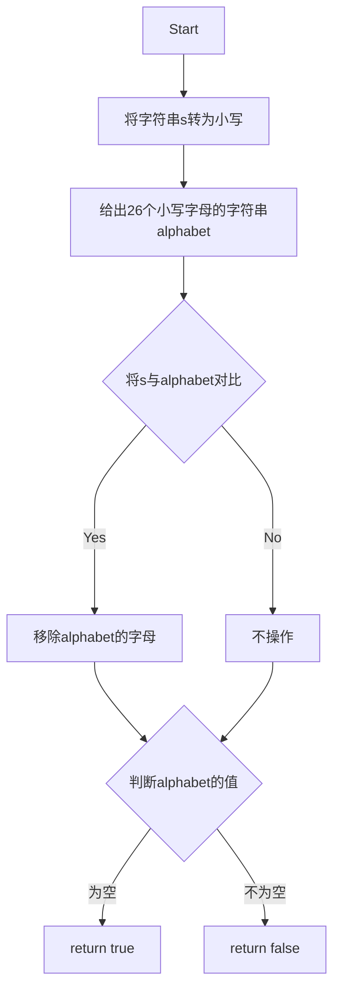

# 实验五 Python数据结构与数据模型

班级： 21计科02班

学号： B20230302210

姓名： 陶鑫

Github地址：<https://github.com/Muyu-ikun>

CodeWars地址：<https://www.codewars.com/users/Muyu-ikun>

---

## 实验目的

1. 学习Python数据结构的高级用法
2. 学习Python的数据模型

## 实验环境

1. Git
2. Python 3.10
3. VSCode
4. VSCode插件

## 实验内容和步骤

### 第一部分

在[Codewars网站](https://www.codewars.com)注册账号，完成下列Kata挑战：

---

#### 第一题：停止逆转我的单词

难度： 6kyu

编写一个函数，接收一个或多个单词的字符串，并返回相同的字符串，但所有5个或更多的字母单词都是相反的（就像这个Kata的名字一样）。传入的字符串将只由字母和空格组成。只有当出现一个以上的单词时，才会包括空格。
例如：

```python
spinWords( "Hey fellow warriors" ) => returns "Hey wollef sroirraw" 
spinWords( "This is a test") => returns "This is a test" 
spinWords( "This is another test" )=> returns "This is rehtona test"
```

代码提交地址：
<https://www.codewars.com/kata/5264d2b162488dc400000001>

提示：

- 利用str的split方法可以将字符串分为单词列表
例如：

```python
words = "hey fellow warrior".split()
# words should be ['hey', 'fellow', 'warrior']
```

- 利用列表推导将长度大于等于5的单词反转(利用切片word[::-1])
- 最后使用str的join方法连结列表中的单词。

```python
def spin_words(sentence):
    words = sentence.split()

    for i in range (len(words)):
        if len(words[i]) >= 5:
            words[i] = words[i][::-1]

    result = ''.join(words)

    return result
    # Your code goes here
    return None

```

---

#### 第二题： 发现离群的数(Find The Parity Outlier)

难度：6kyu

给你一个包含整数的数组（其长度至少为3，但可能非常大）。该数组要么完全由奇数组成，要么完全由偶数组成，除了一个整数N。请写一个方法，以该数组为参数，返回这个 "离群 "的N。

例如：

```python
[2, 4, 0, 100, 4, 11, 2602, 36]
# Should return: 11 (the only odd number)

[160, 3, 1719, 19, 11, 13, -21]
# Should return: 160 (the only even number)
```

代码提交地址：
<https://www.codewars.com/kata/5526fc09a1bbd946250002dc>

```python
def find_outlier(integers):

    first_three_paritys = [n % 2 for n in integers[:3]]

    if sum(first_three_paritys) < 2:
        for n in integers:
            if n % 2 == 1 :
                return n

    else:
        for n in integers:
            if n % 2 == 0:
                return n

    return None

```

---

#### 第三题： 检测Pangram

难度：6kyu

pangram是一个至少包含每个字母一次的句子。例如，"The quick brown fox jumps over the lazy dog "这个句子就是一个pangram，因为它至少使用了一次字母A-Z（大小写不相关）。

给定一个字符串，检测它是否是一个pangram。如果是则返回`True`，如果不是则返回`False`。忽略数字和标点符号。
代码提交地址：
<https://www.codewars.com/kata/545cedaa9943f7fe7b000048>

```python
def is_pangram(s):

    s = s.lower()

    alphabet = set('abcdefghijklmnopqrstuvwxyz')

    for char in s:
        if char.isalpha():
            alphabet.discard(char)


    return not alphabet


```

---

#### 第四题： 数独解决方案验证

难度：6kyu

数独背景

数独是一种在 9x9 网格上进行的游戏。游戏的目标是用 1 到 9 的数字填充网格的所有单元格，以便每一列、每一行和九个 3x3 子网格（也称为块）中的都包含数字 1 到 9。更多信息请访问：<http://en.wikipedia.org/wiki/Sudoku>

编写一个函数接受一个代表数独板的二维数组，如果它是一个有效的解决方案则返回 true，否则返回 false。数独板的单元格也可能包含 0，这将代表空单元格。包含一个或多个零的棋盘被认为是无效的解决方案。棋盘总是 9 x 9 格，每个格只包含 0 到 9 之间的整数。

代码提交地址：
<https://www.codewars.com/kata/63d1bac72de941033dbf87ae>

```python
def is_valid_row(row):
    # 检查一行是否包含数字1到9且没有重复
    return sorted(row) == list(range(1, 10))

def validate_sudoku(board):
    # 检查每一行
    for row in board:
        if not is_valid_row(row):
            return False

    # 检查每一列
    for col in zip(*board):
        if not is_valid_row(col):
            return False

    # 检查每个九宫格
    for i in range(0, 9, 3):
        for j in range(0, 9, 3):
            square = [board[x][y] for x in range(i, i+3) for y in range(j, j+3)]
            if not is_valid_row(square):
                return False

    return True

```

---

#### 第五题： 疯狂的彩色三角形

难度： 2kyu

一个彩色的三角形是由一排颜色组成的，每一排都是红色、绿色或蓝色。连续的几行，每一行都比上一行少一种颜色，是通过考虑前一行中的两个相接触的颜色而产生的。如果这些颜色是相同的，那么新的一行就使用相同的颜色。如果它们不同，则在新的一行中使用缺失的颜色。这个过程一直持续到最后一行，只有一种颜色被生成。

例如：
```python
Colour here:            G G        B G        R G        B R
Becomes colour here:     G          R          B          G
```


一个更大的三角形例子：

```python
R R G B R G B B
 R B R G B R B
  G G B R G G
   G R G B G
    B B R R
     B G R
      R B
       G
```

你将得到三角形的第一行字符串，你的工作是返回最后的颜色，这将出现在最下面一行的字符串。在上面的例子中，你将得到 "RRGBRGBB"，你应该返回 "G"。
限制条件： 1 <= length(row) <= 10 ** 5
输入的字符串将只包含大写字母'B'、'G'或'R'。

例如：

```python
triangle('B') == 'B'
triangle('GB') == 'R'
triangle('RRR') == 'R'
triangle('RGBG') == 'B'
triangle('RBRGBRB') == 'G'
triangle('RBRGBRBGGRRRBGBBBGG') == 'G'
```

代码提交地址：
<https://www.codewars.com/kata/5a331ea7ee1aae8f24000175>

提示：请参考下面的链接，利用三进制的特点来进行计算。
<https://stackoverflow.com/questions/53585022/three-colors-triangles>

---

### 第二部分

使用Mermaid绘制程序流程图

安装VSCode插件：

- Markdown Preview Mermaid Support
- Mermaid Markdown Syntax Highlighting

使用Markdown语法绘制你的程序绘制程序流程图（至少一个），Markdown代码如下：


显示效果如下：



查看Mermaid流程图语法-->[点击这里](https://mermaid.js.org/syntax/flowchart.html)

代码运行结果的文本可以直接粘贴在这里。

**注意：不要使用截图，因为Markdown文档转换为Pdf格式后，截图会无法显示。**

## 实验考查

请使用自己的语言并使用尽量简短代码示例回答下面的问题，这些问题将在实验检查时用于提问和答辩以及实际的操作。

1. 集合（set）类型有什么特点？它和列表（list）类型有什么区别？

无序性：集合中的元素没有固定的顺序，不像列表中的元素是有序的。

唯一性：集合中不允许包含重复的元素，每个元素在集合中只能出现一次。

可变性：集合本身是可变的，你可以添加或删除元素。但集合中的元素必须是不可变的，例如数字、字符串、元组等，不可以包含列表、字典等可变对象。

使用大括号{}表示：集合可以用大括号或set()构造函数来创建，但要注意，使用大括号创建空集合时，会创建一个空字典。要创建空集合，应使用set()。

与列表类型的区别：

无序性和唯一性：列表是有序的，元素可以重复，而集合是无序的，元素不允许重复。

索引：列表支持通过索引访问元素，而集合不支持，因为元素没有固定的顺序。

可变性：列表是可变的，你可以修改列表中的元素，添加或删除元素。集合也是可变的，但只允许添加或删除元素，不能修改集合中的元素。

使用方式：列表通常用于有序的数据集合，而集合常用于去重和判断成员资格的操作。
2. 集合（set）类型主要有那些操作？

创建集合。
添加元素。
移除元素。
清空集合。
复制集合。
联合（并集）。
交集。
差集。
对称差集。
子集和超集检查。

3. 使用`*`操作符作用到列表上会产生什么效果？为什么不能使用`*`操作符作用到嵌套的列表上？使用简单的代码示例说明。

如果你有一个包含嵌套列表的列表，* 操作符只会重复嵌套列表的引用，而不会复制内部的列表。这意味着内部列表是共享的。如果你修改一个内部列表，所有重复的引用也会受到影响。

例如，如果你有一个包含嵌套列表 [1, 2, [3, 4]]，并使用 * 操作符重复它两次，你将得到一个新的列表 [1, 2, [3, 4], 1, 2, [3, 4]]。但内部的 [3, 4] 列表实际上是相同的列表对象。如果你修改一个内部的 [3, 4]，所有重复的引用都会反映这个修改。

4. 总结列表,集合，字典的解析（comprehension）的使用方法。使用简单的代码示例说明。

列表、集合和字典解析（comprehension）是Python中用于创建新数据结构的强大工具。它们允许你以紧凑、可读的方式从现有数据结构创建新的数据结构

## 实验总结

编程工具的使用：我使用了Python编程语言来解决各种编程问题，包括字符串处理、集合操作、列表操作和流程控制。

数据结构：我了解了不同的数据结构，包括列表、集合和字典，以及它们的特点和用途。

Python编程语言的语法：我复习了Python编程语言的语法规则，包括变量、循环、条件语句和函数的使用。

算法：我应用了一些简单的算法来解决编程问题，例如字符串处理和集合操作。

编程技巧：我学习了一些编程技巧，如列表解析、集合解析和字典解析，以更紧凑和可读的方式创建新的数据结构。

编程思想：我学习了如何通过分析问题、设计算法和编写代码来解决编程问题的思维过程。

总的来说，这次实验帮助我巩固了Python编程语言的知识，提高了我的编程技能，特别是在字符串处理和数据结构操作方面。我还学到了一些编程技巧和思维方式，以更高效地解决问题。这些知识和技能对于编程和计算机科学领域非常有用。
