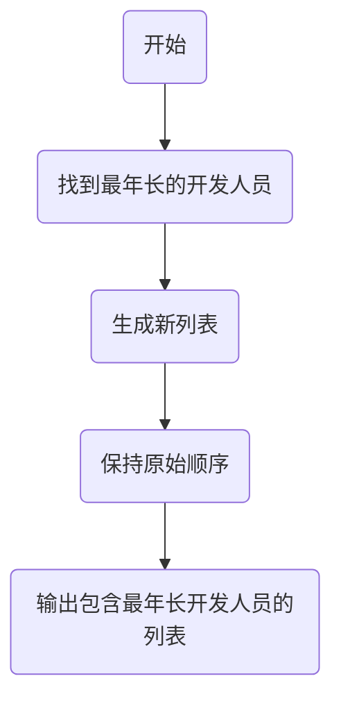

# 实验六 Python函数

班级： 21计科02班

学号： B20230302210

姓名： 陶鑫

Github地址：<https://github.com/Muyu-ikun>

CodeWars地址：<https://www.codewars.com/users/Muyu-ikun>

---

## 实验目的

1. 学习Python函数的基本用法
2. 学习lambda函数和高阶函数的使用
3. 掌握函数式编程的概念和实践

## 实验环境

1. Git
2. Python 3.10
3. VSCode
4. VSCode插件

## 实验内容和步骤

### 第一部分

Python函数

完成教材《Python编程从入门到实践》下列章节的练习：

- 第8章 函数

---

### 第二部分

在[Codewars网站](https://www.codewars.com)注册账号，完成下列Kata挑战：

---

#### 第一题：编码聚会1

难度： 7kyu

你将得到一个字典数组，代表关于首次报名参加你所组织的编码聚会的开发者的数据。
你的任务是返回来自欧洲的JavaScript开发者的数量。
例如，给定以下列表：

```python
lst1 = [
  { 'firstName': 'Noah', 'lastName': 'M.', 'country': 'Switzerland', 'continent': 'Europe', 'age': 19, 'language': 'JavaScript' },
  { 'firstName': 'Maia', 'lastName': 'S.', 'country': 'Tahiti', 'continent': 'Oceania', 'age': 28, 'language': 'JavaScript' },
  { 'firstName': 'Shufen', 'lastName': 'L.', 'country': 'Taiwan', 'continent': 'Asia', 'age': 35, 'language': 'HTML' },
  { 'firstName': 'Sumayah', 'lastName': 'M.', 'country': 'Tajikistan', 'continent': 'Asia', 'age': 30, 'language': 'CSS' }
]
```

你的函数应该返回数字1。
如果，没有来自欧洲的JavaScript开发人员，那么你的函数应该返回0。

注意：
字符串的格式将总是"Europe"和"JavaScript"。
所有的数据将始终是有效的和统一的，如上面的例子。

这个卡塔是Coding Meetup系列的一部分，其中包括一些简短易行的卡塔，这些卡塔是为了让人们掌握高阶函数的使用。在Python中，这些方法包括：`filter`, `map`, `reduce`。当然也可以采用其他方法来解决这些卡塔。

[代码提交地址](https://www.codewars.com/kata/coding-meetup-number-1-higher-order-functions-series-count-the-number-of-javascript-developers-coming-from-europe)

```python
def count_developers(lst):
    count = 0  

    for developer in lst:
        if developer['continent'] == 'Europe' and developer['language'] == 'JavaScript':
            count += 1

    return count

    pass

```

---

#### 第二题： 使用函数进行计算

难度：5kyu

这次我们想用函数来写计算，并得到结果。让我们看一下一些例子：

```python
seven(times(five())) # must return 35
four(plus(nine())) # must return 13
eight(minus(three())) # must return 5
six(divided_by(two())) # must return 3
```

要求：

- 从0（"零"）到9（"九"）的每个数字都必须有一个函数。
- 必须有一个函数用于以下数学运算：加、减、乘、除。
- 每个计算都由一个操作和两个数字组成。
- 最外面的函数代表左边的操作数，最里面的函数代表右边的操作数。
- 除法应该是整数除法。

例如，下面的计算应该返回2，而不是2.666666...。

```python
eight(divided_by(three()))
```

代码提交地址：
<https://www.codewars.com/kata/525f3eda17c7cd9f9e000b39>

```python
def zero(func=None):
    return 0 if func is None else func(0)

def one(func=None):
    return 1 if func is None else func(1)

def two(func=None):
    return 2 if func is None else func(2)

def three(func=None):
    return 3 if func is None else func(3)

def four(func=None):
    return 4 if func is None else func(4)

def five(func=None):
    return 5 if func is None else func(5)

def six(func=None):
    return 6 if func is None else func(6)

def seven(func=None):
    return 7 if func is None else func(7)

def eight(func=None):
    return 8 if func is None else func(8)

def nine(func=None):
    return 9 if func is None else func(9)

def plus(y):
    return lambda x: x + y

def minus(y):
    return lambda x: x - y

def times(y):
    return lambda x: x * y

def divided_by(y):
    return lambda x: x // y

```

---

#### 第三题： 缩短数值的过滤器(Number Shortening Filter)

难度：6kyu

在这个kata中，我们将创建一个函数，它返回另一个缩短长数字的函数。给定一个初始值数组替换给定基数的 X 次方。如果返回函数的输入不是数字字符串，则应将输入本身作为字符串返回。

例子：

```python
filter1 = shorten_number(['','k','m'],1000)
filter1('234324') == '234k'
filter1('98234324') == '98m'
filter1([1,2,3]) == '[1,2,3]'
filter2 = shorten_number(['B','KB','MB','GB'],1024)
filter2('32') == '32B'
filter2('2100') == '2KB';
filter2('pippi') == 'pippi'
```

代码提交地址：
<https://www.codewars.com/kata/56b4af8ac6167012ec00006f>

```python
def shorten_number(suffixes, base):
    def shorten(value):
        try:
            value = int(value)
            if value < base:
                return str(value) + suffixes[0]
            for i in range(len(suffixes) - 1):
                suffix = suffixes[i + 1]
                divisor = base ** (i + 1)
                if value < base * base:
                    return str(int(value // base)) + suffix
                value //= base
            return f"{value:.0f}" + suffixes[-1]  # 处理最后一个单位
        except (ValueError, TypeError):
            return str(value)
    return shorten


```

---

#### 第四题： 编码聚会7

难度： 6kyu

您将获得一个对象序列，表示已注册参加您组织的下一个编程聚会的开发人员的数据。

您的任务是返回一个序列，其中包括最年长的开发人员。如果有多个开发人员年龄相同，则将他们按照在原始输入数组中出现的顺序列出。

例如，给定以下输入数组：
```python
list1 = [
  { 'firstName': 'Gabriel', 'lastName': 'X.', 'country': 'Monaco', 'continent': 'Europe', 'age': 49, 'language': 'PHP' },
  { 'firstName': 'Odval', 'lastName': 'F.', 'country': 'Mongolia', 'continent': 'Asia', 'age': 38, 'language': 'Python' },
  { 'firstName': 'Emilija', 'lastName': 'S.', 'country': 'Lithuania', 'continent': 'Europe', 'age': 19, 'language': 'Python' },
  { 'firstName': 'Sou', 'lastName': 'B.', 'country': 'Japan', 'continent': 'Asia', 'age': 49, 'language': 'PHP' },
]
```

您的程序应该返回如下结果：

```python
[
  { 'firstName': 'Gabriel', 'lastName': 'X.', 'country': 'Monaco', 'continent': 'Europe', 'age': 49, 'language': 'PHP' },
  { 'firstName': 'Sou', 'lastName': 'B.', 'country': 'Japan', 'continent': 'Asia', 'age': 49, 'language': 'PHP' },
]
```

注意：

- 输入的列表永远都包含像示例中一样有效的正确格式的数据，而且永远不会为空。

代码提交地址：
<https://www.codewars.com/kata/582887f7d04efdaae3000090>

```python
def find_senior(lst): 
    max_age = max(lst, key=lambda x: x['age'])  # 找到最年长的开发人员
    
    senior_developers = [developer for developer in lst if developer['age'] == max_age['age']]
    
    return senior_developers

```

---

#### 第五题： Currying versus partial application

难度： 4kyu

[Currying versus partial application](https://2ality.com/2011/09/currying-vs-part-eval.html)是将一个函数转换为具有更小arity(参数更少)的另一个函数的两种方法。虽然它们经常被混淆，但它们的工作方式是不同的。目标是学会区分它们。

Currying

是一种将接受多个参数的函数转换为以每个参数都只接受一个参数的一系列函数链的技术。

Currying接受一个函数：

```python
f：X × Y → R
```

并将其转换为一个函数：

```python
f'：X → (Y → R)
```

我们不再使用两个参数调用f，而是使用第一个参数调用f'。结果是一个函数，然后我们使用第二个参数调用该函数来产生结果。因此，如果非curried f被调用为：

```python
f(3, 5)
```

那么curried f'被调用为：

```python
f'(3)(5)
```

示例
给定以下函数：

```python
def add(x, y, z):
  return x + y + z
```

我们可以以普通方式调用：

```python
add(1, 2, 3) # => 6
```

但我们可以创建一个curried版本的add(a, b, c)函数：

```python
curriedAdd = lambda a: (lambda b: (lambda c: add(a,b,c)))
curriedAdd(1)(2)(3) # => 6
```

Partial application
是将一定数量的参数固定到函数中，从而产生另一个更小arity(参数更少)的函数的过程。

部分应用接受一个函数：

```python
f：X × Y → R
```

和一个固定值x作为第一个参数，以产生一个新的函数

```python
f'：Y → R
```

f'与f执行的操作相同，但只需要填写第二个参数，这就是其arity比f的arity少一个的原因。可以说第一个参数绑定到x。

示例:

```python
partialAdd = lambda a: (lambda *args: add(a,*args))
partialAdd(1)(2, 3) # => 6
```

你的任务是实现一个名为curryPartial()的通用函数，可以进行currying或部分应用。

例如：

```python
curriedAdd = curryPartial(add)
curriedAdd(1)(2)(3) # => 6

partialAdd = curryPartial(add, 1)
partialAdd(2, 3) # => 6
```

我们希望函数保持灵活性。

所有下面这些例子都应该产生相同的结果：

```python
curryPartial(add)(1)(2)(3) # =>6 
curryPartial(add, 1)(2)(3) # =>6 
curryPartial(add, 1)(2, 3) # =>6 
curryPartial(add, 1, 2)(3) # =>6 
curryPartial(add, 1, 2, 3) # =>6 
curryPartial(add)(1, 2, 3) # =>6 
curryPartial(add)(1, 2)(3) # =>6 
curryPartial(add)()(1, 2, 3) # =>6 
curryPartial(add)()(1)()()(2)(3) # =>6 

curryPartial(add)()(1)()()(2)(3, 4, 5, 6) # =>6 
curryPartial(add, 1)(2, 3, 4, 5) # =>6 

curryPartial(curryPartial(curryPartial(add, 1), 2), 3) # =>6
curryPartial(curryPartial(add, 1, 2), 3) # =>6
curryPartial(curryPartial(add, 1), 2, 3) # =>6
curryPartial(curryPartial(add, 1), 2)(3) # =>6
curryPartial(curryPartial(add, 1)(2), 3) # =>6
curryPartial(curryPartial(curryPartial(add, 1)), 2, 3) # =>6
```

代码提交地址：
<https://www.codewars.com/kata/53cf7e37e9876c35a60002c9>

---

### 第三部分

使用Mermaid绘制程序流程图

使用Markdown语法绘制你的程序绘制程序流程图（至少一个），Markdown代码如下：


显示效果如下：



## 实验考查

请使用自己的语言并使用尽量简短代码示例回答下面的问题，这些问题将在实验检查时用于提问和答辩以及实际的操作。

1. 什么是函数式编程范式？

函数式编程范式（Functional Programming Paradigm）是一种编程范式，它强调在编程中将计算视为数学函数的应用，避免更改状态和可变数据。函数式编程的核心思想包括以下关键概念：

 **纯函数（Pure Functions）**：纯函数是一种没有副作用的函数，其输出仅依赖于输入。这意味着相同的输入将始终产生相同的输出，而不会影响程序的状态或全局变量。这种特性使得代码更加可预测和可维护。

 **不可变性（Immutability）**：不可变性是指数据一旦创建就不能被修改的概念。在函数式编程中，数据通常被视为不可变的，而在需要更改数据时，会创建新的数据对象而不是修改现有对象。

 **高阶函数（Higher-Order Functions）**：高阶函数是可以接受其他函数作为参数或将函数作为返回值的函数。这使得函数可以灵活组合和重用，例如，可以使用高阶函数来实现映射、过滤、折叠等操作。

 **递归（Recursion）**：函数式编程鼓励使用递归而不是循环来解决问题。递归是一种自我调用的技术，用于解决问题，特别适用于处理树形结构和列表等数据结构。

 **不可改变的数据结构（Immutable Data Structures）**：函数式编程通常使用不可改变的数据结构，例如不可变列表、不可变映射，以避免副作用和提高性能。

 **Lambda表达式（Lambda Expressions）**：Lambda表达式是匿名函数，允许在需要函数的地方定义函数，通常用于传递给高阶函数。

 **惰性求值（Laziness）**：函数式编程支持惰性求值，这意味着只有在需要时才计算结果。这可以提高性能，尤其是处理无限序列时。

 **无状态（Statelessness）**：函数式编程尽量避免共享可变状态，从而减少并发编程中的竞态条件和错误。


2. 什么是lambda函数？请举例说明。

Lambda函数，也被称为匿名函数，是一种在编程中用于创建小型、无需命名的函数的方式。Lambda函数通常用于函数式编程范式，特别是在需要传递函数作为参数的上下文中非常有用。Lambda函数在编写简单的函数或临时的函数时很方便，无需显式定义函数名称。

Lambda函数的一般语法如下：

```python
lambda arguments: expression
```

- `arguments`：是Lambda函数的参数列表，可以包含零个或多个参数。
- `expression`：是Lambda函数的表达式，用于计算结果。

以下是一个Lambda函数的简单示例：

```python
# Lambda函数用于求平方
square = lambda x: x * x

# 使用Lambda函数
result = square(5)
print(result)  # 输出 25
```

在这个示例中，Lambda函数接受一个参数 `x`，并返回 `x` 的平方。Lambda函数通常与高阶函数一起使用，例如`map`、`filter`、`sorted`等。以下是Lambda函数在`map`函数中的示例：

```python
numbers = [1, 2, 3, 4, 5]
# 使用Lambda函数计算每个数的平方
squared_numbers = list(map(lambda x: x * x, numbers))
print(squared_numbers)  # 输出 [1, 4, 9, 16, 25]
```

在这个示例中，Lambda函数用于`map`函数，以计算列表中每个元素的平方。Lambda函数的使用可以使代码更简洁，并允许将函数作为参数传递，用于不同的操作。Lambda函数通常用于短暂的、一次性的函数需求。

3.  什么是高阶函数？常用的高阶函数有哪些？这些高阶函数如何工作？使用简单的代码示例说明。

高阶函数是指可以接受其他函数作为参数，或者将函数作为返回值的函数。在函数式编程中，高阶函数是一种强大的工具，它使得函数可以作为一等公民，可以用来抽象通用的操作，提高代码的模块性和可重用性。

以下是一些常用的高阶函数以及它们的简要说明：

1. `map`：`map`函数接受一个函数和一个可迭代对象，它将函数应用于可迭代对象的每个元素，并返回一个包含结果的新可迭代对象。

```python
numbers = [1, 2, 3, 4, 5]
squared_numbers = list(map(lambda x: x * x, numbers))
# 输出：[1, 4, 9, 16, 25]
```

2. `filter`：`filter`函数接受一个函数和一个可迭代对象，它将函数应用于可迭代对象的每个元素，并返回一个包含满足条件的元素的新可迭代对象。

```python
numbers = [1, 2, 3, 4, 5]
even_numbers = list(filter(lambda x: x % 2 == 0, numbers))
# 输出：[2, 4]
```

3. `reduce`：`reduce`函数接受一个函数和一个可迭代对象，它对可迭代对象中的元素进行累积操作，将结果返回。

```python
from functools import reduce
numbers = [1, 2, 3, 4, 5]
sum = reduce(lambda x, y: x + y, numbers)
# 输出：15
```

4. `sorted`：`sorted`函数接受一个可迭代对象和一个可选的排序函数，它返回一个排序后的新列表。

```python
numbers = [5, 2, 1, 4, 3]
sorted_numbers = sorted(numbers)
# 输出：[1, 2, 3, 4, 5]
```

5. `any` 和 `all`：`any`函数接受一个可迭代对象，如果可迭代对象中的任何元素满足条件，则返回`True`，否则返回`False`。`all`函数类似，但要求可迭代对象中的所有元素满足条件。

```python
numbers = [1, 2, 3, 4, 5]
result_any = any(x > 4 for x in numbers)
# 输出：True
result_all = all(x > 4 for x in numbers)
# 输出：False
```

## 实验总结

总结一下这次实验你学习和使用到的知识，例如：编程工具的使用、数据结构、程序语言的语法、算法、编程技巧、编程思想。

这次实验中我学会了一些python中的高级函数的使用方法，这有助于我更好的去完成题目的需求。